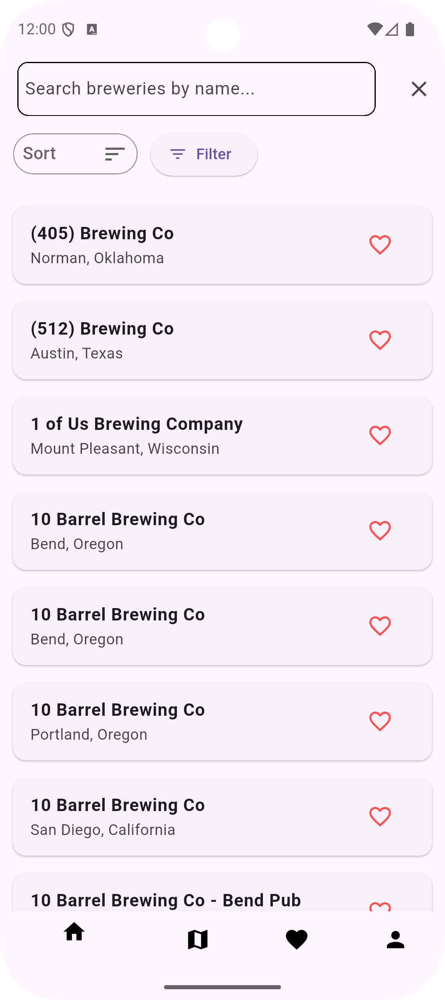
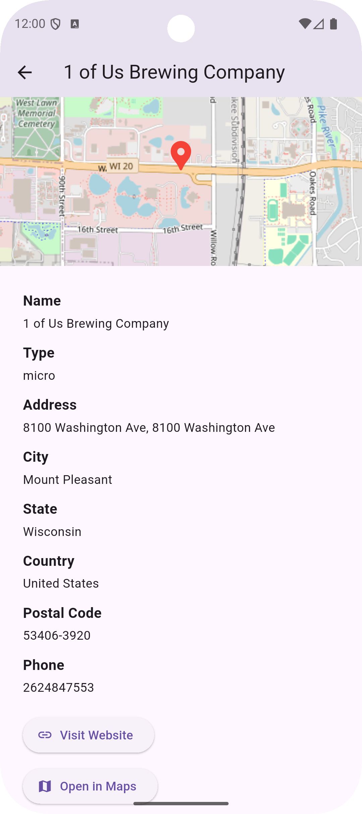
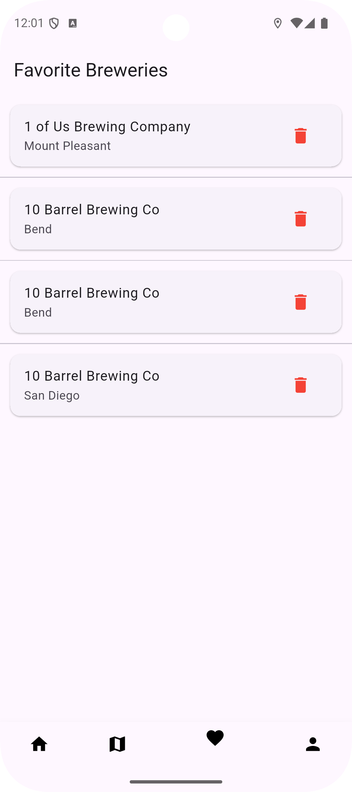

# Brewery Explorer

Brewery Explorer is a Flutter application that helps users discover breweries around the world using the Open Brewery API. It provides browsing, searching, filtering, and a detail view with location links.

## Features

- Browse breweries with name, type and location
- Search breweries by name
- Filter results by type and location
- View detailed brewery information (address, phone, website, coordinates)
- Open brewery location in external map apps
- Modular, maintainable Flutter codebase

## Why this project

This project is a practical example of a Flutter app that demonstrates:
- REST API integration and JSON parsing
- State management and navigation
- Map integration
- Clean project structure suitable for extension or as a portfolio piece

## Getting started

### Prerequisites
- Flutter SDK (version 3.30 or higher recommended)
- An Android or iOS device or emulator
- Basic familiarity with Flutter and Dart

### Install and run
```bash
git clone https://github.com/pranav9588/brewery-explorer.git
cd brewery-explorer
flutter pub get
flutter run
```

### Project Structure 
```bash
lib/
 ├── models/          # Data models
 ├── services/        # API and business logic
 ├── ui/              # UI pages and routes
 ├── ui/widgets/      # Reusable UI components
assets/               # Images, icons
pubspec.yaml          # Dependencies and asset declarations
```
## Screenshots

Below are some previews of Brewery Explorer in action:

<p align="center">
  
  
  
 
 
</p>
